<style>
h1, .h1, h2, .h2, h3, .h3 {
    margin-top: 30px;
}
p.caption {
  font-size: 0.9em;
  font-style: italic;
  color: grey;
  margin-right: 10%;
  margin-left: 10%;  
  text-align: center;
}
div.blue { background-color:#e6f0ff; border-radius: 5px; padding: 15px;}
div.green { background-color:#E0F1D9; border-radius: 5px; padding: 15px;}
</style>
Overview of the Project
=======================

For living or staying in Singapore, a major expenditure item for most people is the expenditure on residential properties. Majority of the Singaporean and permanent residents owned and stayed in non-landed residential properties comprising of HDB developed housing units or privately developed residential properties funded by their monthly mortgage instalment payment. There is also a significant number of Singaporean, permanent residents and foreigners who arrived in Singapore for employments stayed in rented residential properties: HDB or private.

Problem Statements
==================

For a person interested to stay in non-landed private apartment, he or she will face a wide range of choices. Subjected to the budget constraint for the lease, he or she has to select based on the apartment’s location, kind of facilities available and amenities (e.g. nearby MRT, supermarket etc) surrounding the property.

For a person interested to make an investment in non-landed private apartment for passive rental income, subjected to the budget constraint to invest in the property, he or she has a difficult choice to make in terms of whether to invest in newly developed or existing property and the location to search for property which will offer the suitable rental rate.

It is widely acknowledged that the rental price rate per square feet (sq.ft) is largely driven by the location of the property, and to certain extent the economic condition of Singapore which influence the demand (e.g. inflow of foreigners into the country for employment) and supply (e.g. vacancy and newly developed unit available for let) of the private residential units for rental market. However, the expectation of the rental price is usually based on the recently transacted rental price of neighboring apartments.

Project’s Objective
===================

Amongst the driving forces of the rental rate for private residential property, we would like to establish some useful metrics that could help to provide a measure for the expected rental rate in different locations. These analysis result can be used as benchmark information for house hunters during their search through the internet listing to rent their ideal home.

Project's Scope
===============

We will explore the relationship of non-landed private residential properties rental rates using 3 metrices:

-   Age of the properties derived from the TOP year
-   Location of the properties based on District and Region
-   Distance from MRT stations.

If there is a significant correlation for the rental rate, age of the property, its location and distance from MRT, we will go further to establish a model to depict such a relationship.

Dataset(s)
----------

Source of data for private residential properties’ rental transactions is obtained from Urban Redevelopment Authority (“URA”) website. URA publishes URA related data for public use and is available for download via API data service. The data service provides past 36 months rental transactions data with rental contracts submitted to IRAS for Stamp Duty assessment in JSON format.

-   <https://www.ura.gov.sg/maps/api/private-residential-properties-rental-contract>

Data for the private residential properties’ TOP (by year) and MRT proximity is obtained via web scrapping from the SingaporeExpats.com website:

-   <https://condo.singaporeexpats.com>
-   <https://www.singaporeexpats.com/singapore-property-pictures/photos-A-G.htm>

Data Collection
===============

All web scaping routines are consolidated into smur package for easy access in this capstone project.

R source code is also available in github for reference

-   <https://github.com/portergoh/capstone>

Partition our condo dataset
---------------------------

We split our main dataset (3,128) into 2 groups,

-   training (2,346)
-   testing (782)

First, we choose an arbitary seed number as the starting point to be used in the generation of a sequence of random numbers.

Training sample is used for evaluating our models during analysis and the test set will be used to validate and cross check against the effectiveness and accuracy of our chosen model.

*\* Please ensure that you have provided the same seed number in order to obtain the same result everytime you run your analysis.*

Data Visualisation
==================

Dependent variable - Median Rental Rate/sqft
--------------------------------------------

### Observation using density plot

Our dependent variable is the Median Rent Rate/sqft for private non-landed properties in Singapore.

Density plot provides a visual judgment about whether the distribution is bell shaped. We are seeing the rental rate to be rightly skewed.

A log transformation maybe useful to normalise the distribution.

<br>

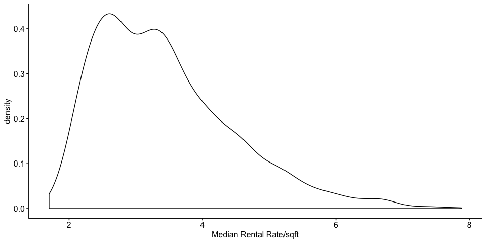

### Observation using Q-Q plot

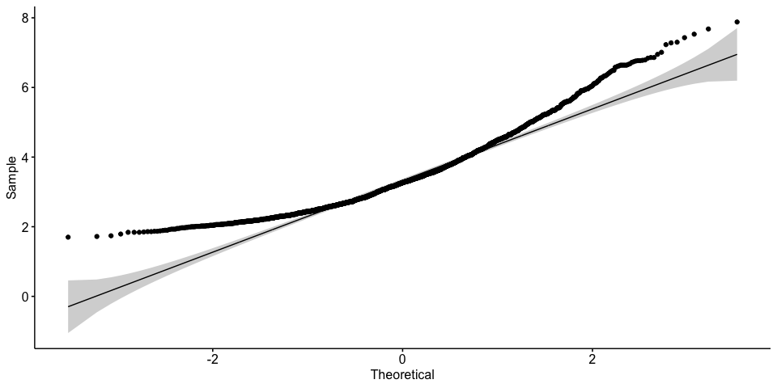

    ## 
    ##  Shapiro-Wilk normality test
    ## 
    ## data:  train_set$median_rent
    ## W = 0.93446, p-value < 2.2e-16

As all the points doesn't fall approximately along the reference line, we cannot assume normality. This is further confirmed by the Shapiro-Wilk's test. From the output, the p-value &lt; 0.05, implying that the distribution of the data are significantly different from normal distribution.

Independent variable - Condo age
--------------------------------

### Observation using scatter plot and regression

Property age is often one of the important criteria for home hunters when they decide on whether to rent the place.

As expected, we observed an inverse relationship between Median Rental rate and Condo age. We can see that as the property become older, the median rental rate drops.

We also plotted 3 regression lines using

-   darkgreen: LOWESS (LOcally WEighted Scatter-plot Smoother)
-   deepskyblue: Straight line in Linear Regression
-   red: Curve Fitting using Polynomial Terms in Linear Regression

It appears that our regression line may fit better using curvilinear than a straight line. There is more well balanced data points center around the curve than the straight line at the 40th year mark.

<br>

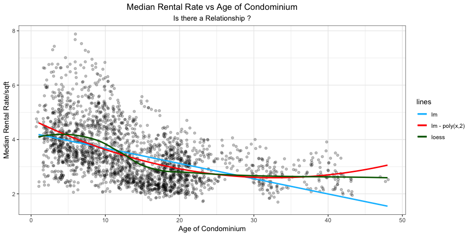

### using boxplot

1st year condominium tend to command a premium in median rental rate. It could also be related to new condo which are pricier, therefore is able to charged a higher rental rates.

Older condos, especially those more than 20 years, they are much cheaper to rent.

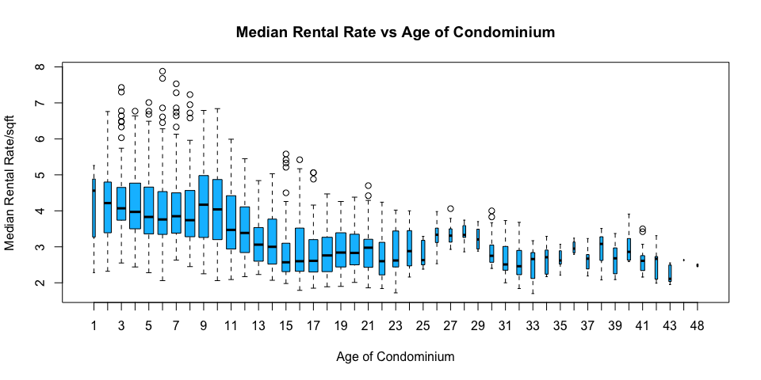

### using boxplot with Categorical age

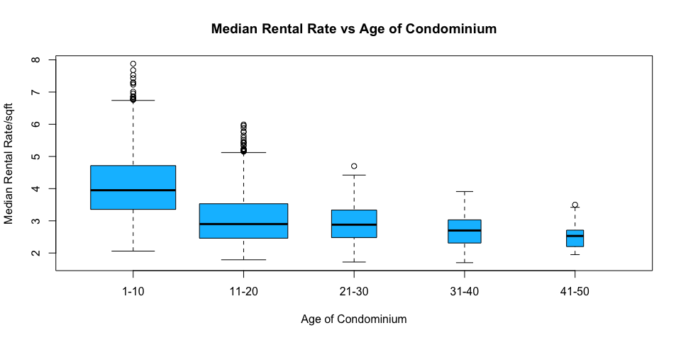

    ## # A tibble: 5 x 2
    ##   condo_age_f rent_rate
    ##   <fct>           <dbl>
    ## 1 1-10             3.95
    ## 2 11-20            2.9 
    ## 3 21-30            2.88
    ## 4 31-40            2.7 
    ## 5 41-50            2.53

After breaking the age into decade, we can now observed better that the fall turn steeper from the 10-20 year mark (average fall ~$0.5/sqft for every 5 years) and then slow down. Over the next 3 decades, the total fall is estimated about only 0.4/sqft.

*\* Outliers between age group 1-20 years maybe a concern and need to be reviewed using Cook's distance to check for influential points.*

### Observations of Median Rental Rate contracts

In terms of the rental contracts submitted to URA over a period of 3 years from (2015 - 2017), it seems that properties after 21 years old are less attractive to users, and therefore we see lesser contracts submitted, making the distribution right skewed.

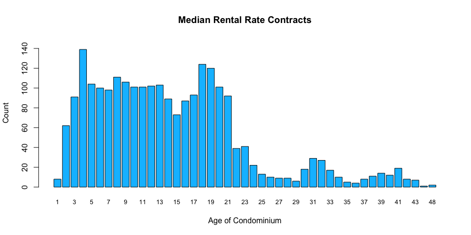

### Condo age and Median Rental Rate with region perspective

From the visual interpretation of this plot, we can see a distinctive pattern that properties located in CCR region command the highest median rent rate follow by RCR which is sandwiched in between CCR and OCR.

It looks like the current zoning of districts into CCR, RCR and OCR is applicable for condo rental rates.

<br>

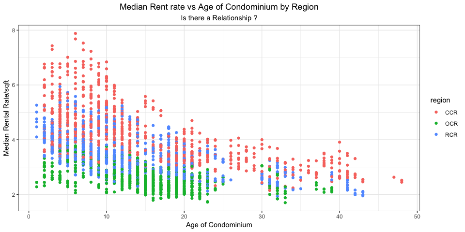

Independent variable - proximity to MRT
---------------------------------------

Next, let us look at how the proximity from MRT for a property may affect its rental rate. We feel that this too maybe an important factor that user will consider when deciding to rent on a property.

### Observation using scatter plot and regression

This plot seems to concur with the popular belief that if your property is located further away from MRT, it will become less attractive to users. However, some properties that are located more than 2.7 km away, appeared to have bucked the trend, suggesting that a curvilinear relationship may be a better fit.

Our regression lines for both polynomial and loess method match closely.

Lack of data points in the 2-3 km range may obscure or influence our analysis as we try to extrapolate our data points.

<br>

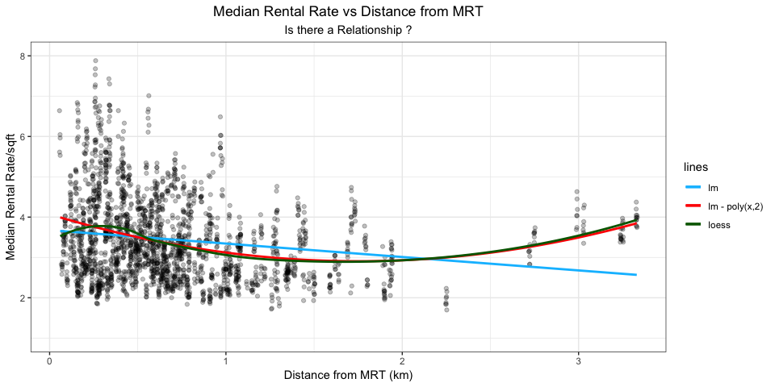

### Distribution of condo measured by proximity to MRT in each district

An interesting observation, District 4 appeared to have the widest IQR in term of distance from MRT.

*- District 4 consists mainly of areas in Keppel, Mount Faber, Sentosa, Telok Blangah*

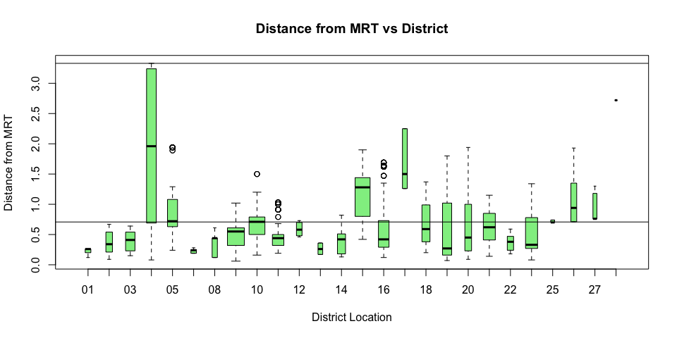

``` r
quantile_val   
```

    ##    25%   100% 
    ## 0.7075 3.3300

In fact, 75% of the data points range widely between 0.7 - 3.3 km mark, indicating a very scattered distribution of the location of properties from MRT.

### What happens if we single out district 4 only ?

After filtering out the rest of the districts, we find that data points for district 4 are located primarily in the left and right hand side of the plot and there is much emptiness in the middle.

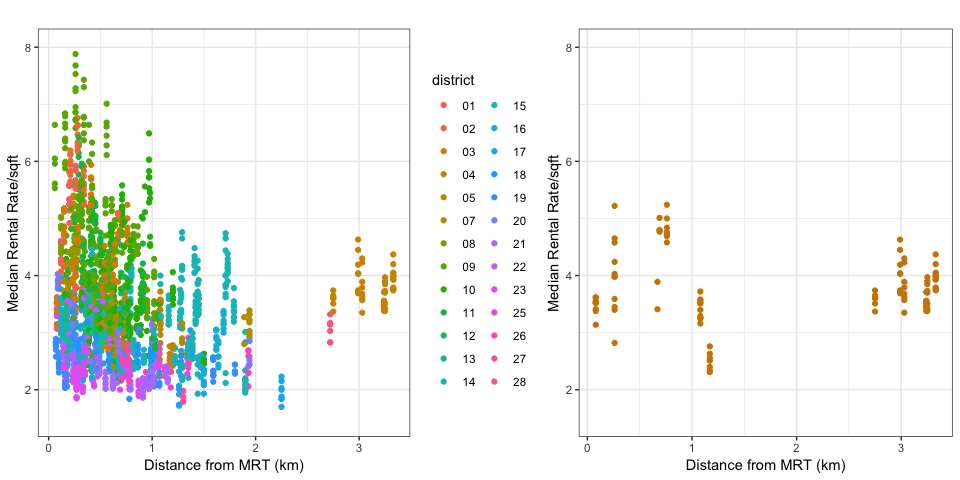

### Compare the scatterplot with and without district 4

A side to side comparison with our earlier scatterplot figure 6.3.1, we can now see that if we had taken out district 4, it may affect our decision on whether it being curvilinear or a straight line.

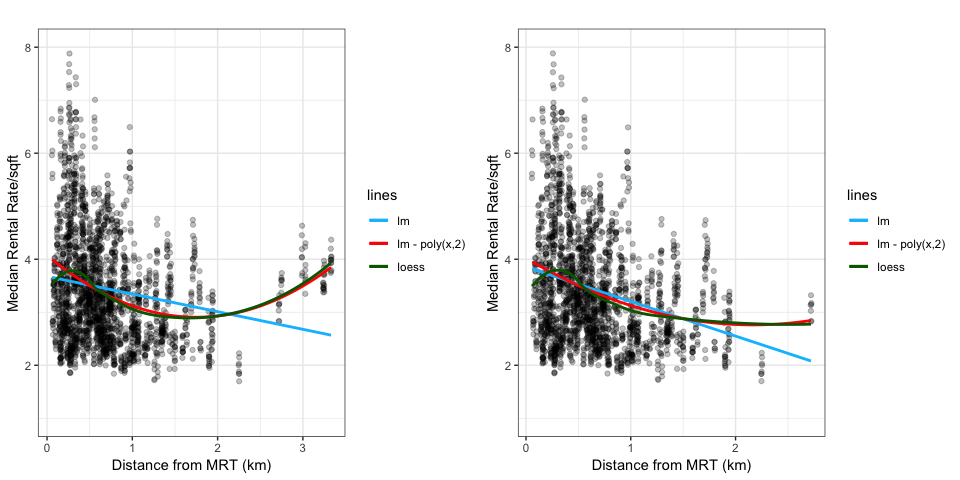

### Rental contracts count measure by proximity to MRT

It seems that the rental contracts that is submitted to URA over a period of 3 years (2015 -2017) falls as the property become further away from MRT.

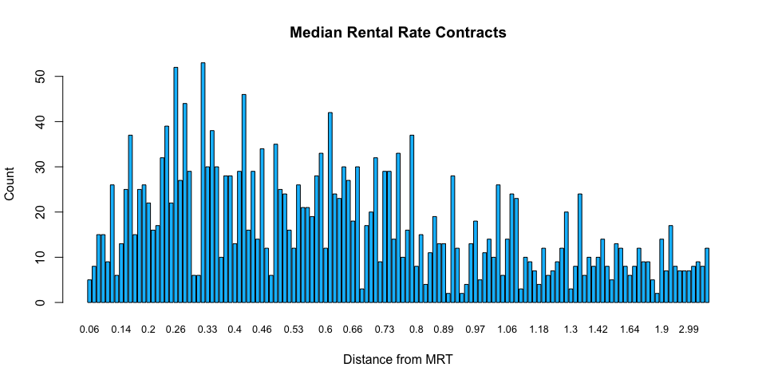

### Condo distribution in each region measured by proximity from MRT

Most of the condo in CCR are within 1km distance from MRT.

Most of the condo in RCR and OCR are within 2km from MRT.

Again, we see district 4 different from the rest, with a wide spread of properties distributed unevenly from MRT.

<br>

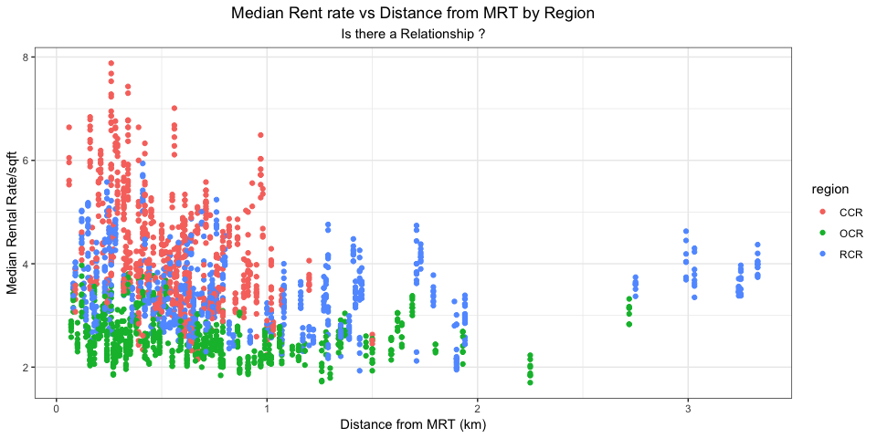

Independent variable - Districts
--------------------------------

### Is there a trend for Median Rental Rate in each districts ?

The median rental rate saw the greatest variation in CCR follow by RCR and OCR. Properties in OCR is most stable in their median rental rate across most districts. <br>

#### Interesting facts on each region

In CCR, condo in District 2 charged the highest median rental rate,

-   **District 10**: charged the lowest median rental rate
-   **District 2**: Anson Road, Chinatown, Neil Road, Raffles Place, Shenton Way, Tanjong Pagar
-   **District 10**: Balmoral, Bukit Timah, Grange Road, Holland, Orchard Boulevard, River Valley, Tanglin

In OCR, condo in District 28 charged the highest median rental rate,

-   **District 17**: charged the lowest median rental rate
-   **District 28**: Seletar, Yio Chu Kang
-   **District 17**: Changi, Loyang, Pasir Ris

In RCR, condo in District 7 charged the highest median rental rate,

-   **District 20**: charged the lowest median rental rate
-   **District 7**: Beach Road, Bencoolen Road, Bugis, Rochor
-   **District 20**: Ang Mo Kio, Bishan, Braddell Road, Thomson

<br>

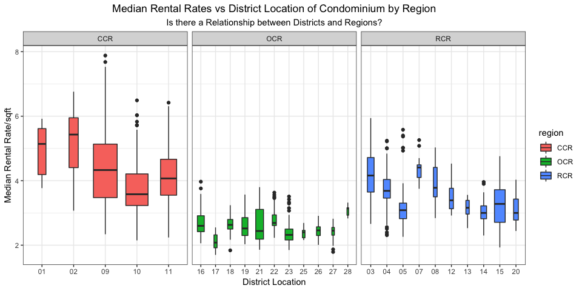

### View from the perspecive of region/districts for Condominium proximity to MRT

Most condos are within 1-2 km from MRT, reaffirming the results in figure 6.3.6

In **CCR**, all districts has IQR less than 1km from MRT.

In **OCR**, only District 17 has IQR above the 1km from MRT.

In **RCR**, District 4 (Keppel, Mount Faber, Sentosa, Telok Blangah) has the widest IQR.

<br> 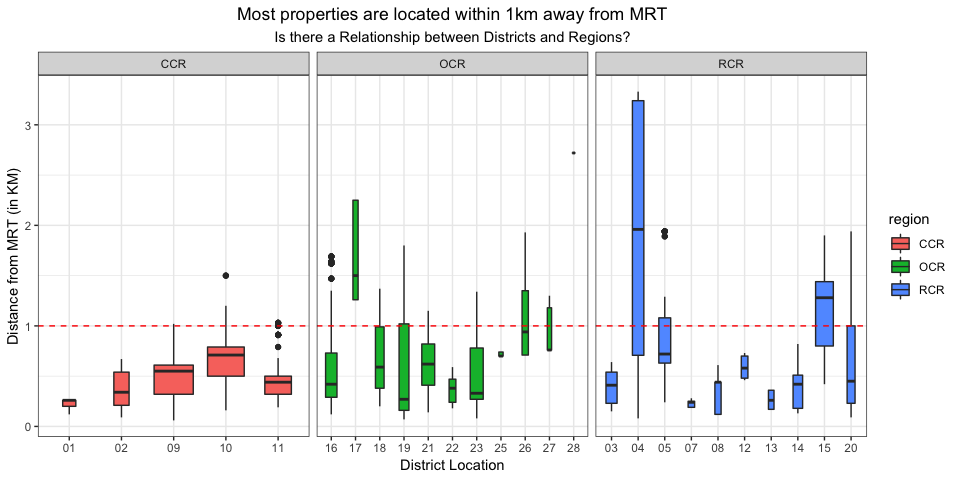

### Rental contracts distribution in each region/districts

We can see that even though the total number of Median rental contracts submitted to URA over a 3 year period (2015-2017) varies widely across different districts, in totality when group by different regions, they are actually quite close to each other.

<br>
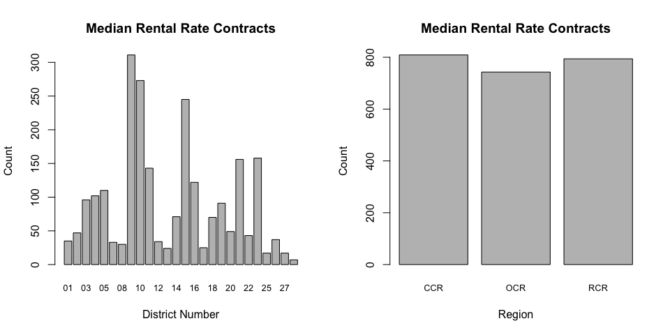
<p class="caption">
Figure 6.4.3: Median rental contracts in each region/districts
</p>

Data Modeling
-------------

### Preleminary test to check the assumptions of our model

Before we begin our modeling, we will first check the correlation metrics between our dependent and explanatory variables. <br> <br>

#### Pearson correlation test - median\_rent vs condo\_age

    ## 
    ##  Pearson's product-moment correlation
    ## 
    ## data:  train_set$median_rent and train_set$condo_age
    ## t = -26.726, df = 2344, p-value < 2.2e-16
    ## alternative hypothesis: true correlation is not equal to 0
    ## 95 percent confidence interval:
    ##  -0.5136993 -0.4516408
    ## sample estimates:
    ##        cor 
    ## -0.4832769

The p-value of the test is 2.2^{-16}, which is less than the significance level alpha = 0.05. We can conclude that median\_rent and condo\_age are significantly correlated with a correlation coefficient of -0.483.

<br>

#### Pearson correlation test - median\_rent vs km

    ## 
    ##  Pearson's product-moment correlation
    ## 
    ## data:  train_set$median_rent and train_set$km
    ## t = -9.0231, df = 2344, p-value < 2.2e-16
    ## alternative hypothesis: true correlation is not equal to 0
    ## 95 percent confidence interval:
    ##  -0.2220393 -0.1438135
    ## sample estimates:
    ##        cor 
    ## -0.1832164

The p-value of the test is 2.2^{-16}, which is less than the significance level alpha = 0.05. We can conclude that median\_rent and km are significantly correlated with a correlation coefficient of -0.183.

<br>

#### Pearson correlation test - condo\_age vs km

    ## 
    ##  Pearson's product-moment correlation
    ## 
    ## data:  train_set$condo_age and train_set$km
    ## t = 0.73811, df = 2344, p-value = 0.4605
    ## alternative hypothesis: true correlation is not equal to 0
    ## 95 percent confidence interval:
    ##  -0.02524098  0.05567866
    ## sample estimates:
    ##       cor 
    ## 0.0152438

The p-value of the test is 0.46, which is more than the significance level alpha = 0.05. We can conclude that condo\_age and km are not significantly correlated with a correlation coefficient of 0.015.

This also means that there would not have any multicollinearity issues since both our explanatory variables are independent.

<br>
